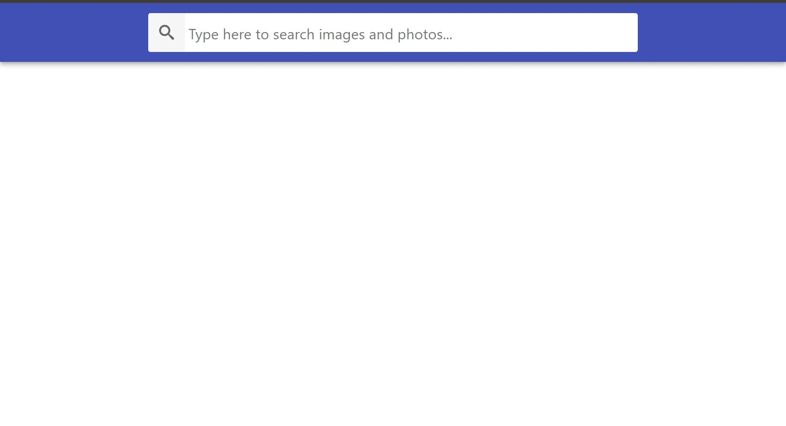
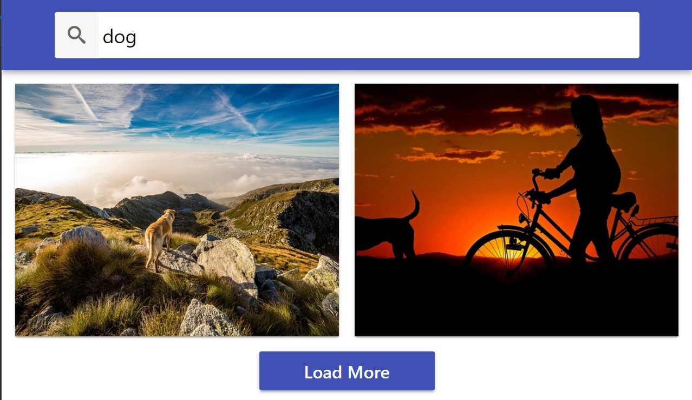
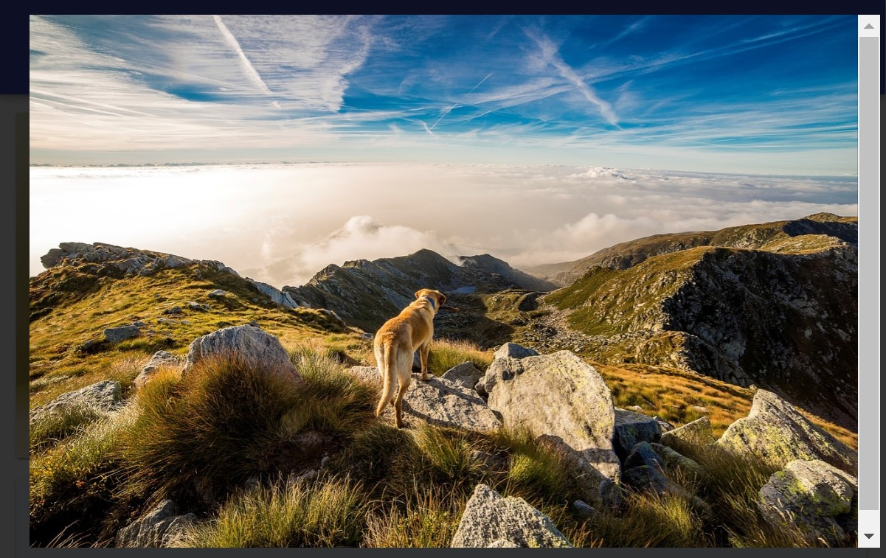

# Image Finder

## Contents
* [General info](#general-info)
* [Technologies](#technologies)
* [Usage](#usage)
* [Examples](#examples)

## General info
Custom Pixabay client. Search Pixabay images and display them in full resolution available.
React web application done as an course assignment.

## Technologies
* React on Vite
* JavaScript
* CSS
* HTML

## Usage
You can try app demo hosted on [GitHub Pages](https://rafallakomiec.github.io/goit-react-hw-04-images/)
Alternatively clone the repository, install [Node.js](https://nodejs.org/en/download/current) and run following commands in your terminal:

```
$ cd ./ // local repository root
$ npm install
$ npm run build
$ npm run preview
```

## Examples




